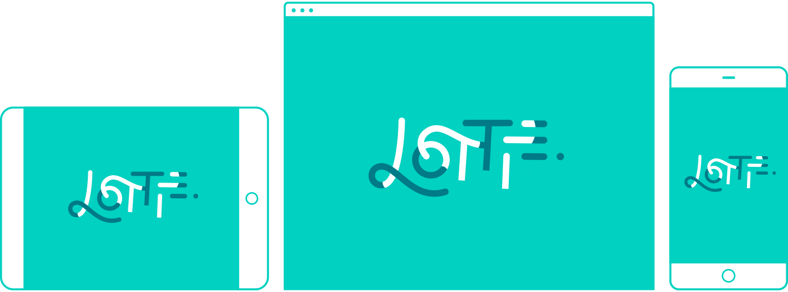
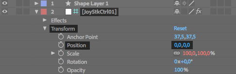

Lottie for React, [React Native](https://github.com/react-community/lottie-react-native), [iOS](https://github.com/airbnb/lottie-ios), and [Android](https://github.com/airbnb/lottie-android)
===

[](https://www.npmjs.com/package/lottie-react-web) [](https://www.npmjs.com/package/lottie-react-native)


<br/><br/>

**Lottie component for React** with runtime animation control.

# Introduction

Lottie is a library for the Web, Android and iOS that parses [Adobe After Effects](http://www.adobe.com/products/aftereffects.html) animations exported as JSON with [bodymovin](https://github.com/bodymovin/bodymovin) and renders them natively on each platform!

For the first time, designers can create **and ship** beautiful animations without an engineer painstakingly recreating it by hand.

*This library is a [react-lottie](https://github.com/chenqingspring/react-lottie) fork that adds the capability for **runtime animation control** and fixes lots of bugs.*

# Getting Started

Get started with Lottie by installing the node module with yarn or npm:

```
yarn add lottie-react-web
```
or
```
npm i --save lottie-react-web
```

# Usage

`<Lottie>` component can be used in a declarative way:

```jsx
import React from 'react';
import Lottie from 'lottie-react-web'
import animation from './animation.json'

const App = () => (
  <Lottie
    options={{
      animationData: animation
    }}
  />
)

export default App
```

By default it will automatically play the animation in loop.

Lottie's animation control can be set via props. Here is an example of a toggle animation that reacts on click:

```jsx
import React, { Component } from 'react';
import Lottie from 'lottie-react-web'
import toggleAnimation from './toggleAnimation.json'

export default class App extends Component {
  this.state = { isToggled: false }

  render() (
    <div
      onClick={() => {
        this.setState(state => { isToggled: !state.isToggled})
      }}
    >
      <Lottie
        direction={this.state.isToggled ? 1 : -1}
        options={{
          animationData: toggleAnimation,
          loop: false,
        }}
      />
    </div>
  )
)

export default App
```

## API
These are all props available:


### Props

| Prop | Description | Default |
|---|---|---|
|**`options`**| **Mandatory** - The object representing the animation settings that will be instantiated by bodymovin. Defines the source of animation (`animationData`), loop, autoplay, a few others. See details in the section below. | `{ autoplay: true, loop: true } ` |
|**`animationControl`**| This is where you can change the animation at runtime. A key value pair of a After Effects property path and the a custom value to apply to it. See details below.  | — |
|**`width`**| Sets the width of the animation container. | `100%` |
|**`height`**| Sets the heigth of the animation container. | `100%` |
|**`isStopped`**| A boolean flag indicating whether or not the animation is stopped. | `false` |
|**`isPaused`**| A boolean flag indicating whether or not the animation is paused. | `false` |
|**`speed`**| An integer indicating the speed of the animation ( `1` is `100%`.) | `1` |
|**`segments`**| An array of two integers indicating the beginning and ending frame of the animation | Defaults to play entire animation |
|**`forceSegment`**| A boolean indicating wether the segments should play immediately or sequentially | `false` |
|**`direction`**| An integer indicating wether the animation progresses in the usual (`1`) or reverse (`-1`) direction | `1` |
|**`ariaRole`**| A string indicating the animation container `ariaRole` property | `"button"` |
|**`ariaLabel`**| A string indicating the animation container `ariaLabel` property | `"animation"` |
|**`title`**| A string indicating the animation container `title` property | `""` |

### Options object
Defines the animation settings that will be instantiated by bodymovin. Currently a subset of the bodymovin options are supported.

| Prop | Description | Default |
|---|---|---|
|**`animationData`**| **Mandatory** - The source of the animation. | — |
|**`loop`**| Play animation non-stop in a loop. | `true` |
|**`autoplay`**| Automatically play animation when it is instantiated. | `true` |
|**`rendererSettings`**| Customize bodymovin aspect ratio configurations. | — |

## Changing animation at runtime
You can target an specific After Effects layer property and change it at
runtime by passing setting a `property` object on the `<Lottie>` prop. Example:

```jsx
import React from 'react';
import Lottie from 'lottie-react-web'
import animation from './animation.json'

const Animation = ({ x, y }) => (
  <Lottie
    options={{
      animationData: animation,
    }}
    animationControl={{
      'Square,Transform,Position': [x, y],
    }}
  />
)

export default Animation
```

This will override the `Position` value of the layer `JoyStkCtrl01` at runtime.

Lottie is compatible with [Joystick 'n Sliders](https://aescripts.com/joysticks-n-sliders/) After Effects plugin, so you can create amazing animations easily.


